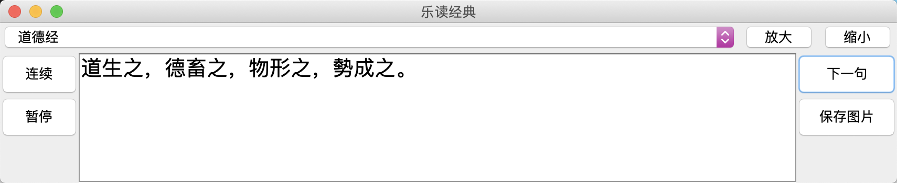
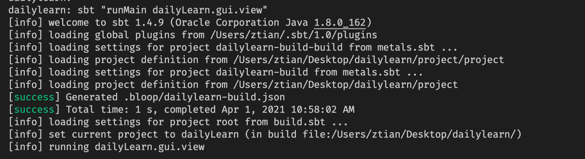

这个软件自带有四本书：论语，道德经，菜根谭，增广贤文。用户们可以选择自己所感兴趣的书籍，默认的是道德经。


你也可以把喜欢的句子保存成图片，图片的名称是“书籍名_日期_时间”，比如说“菜根谭_0328_1054.png”


因为版权原因，如果你想更改字体，比如说用方正的字体库中的行书，那么你可以自己去官网下载，载入ttf文件，来替换默认字体。

运行方式：
请先确保有安装sbt，然后下载这个软件。打开terminal，转到该软件所在的文件夹中，并输入
```
sbt "runMain dailyLearn.gui.view"
```
图例：
